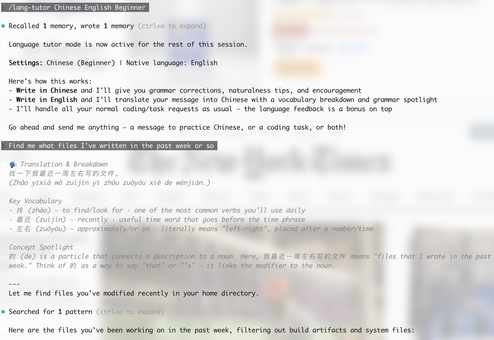
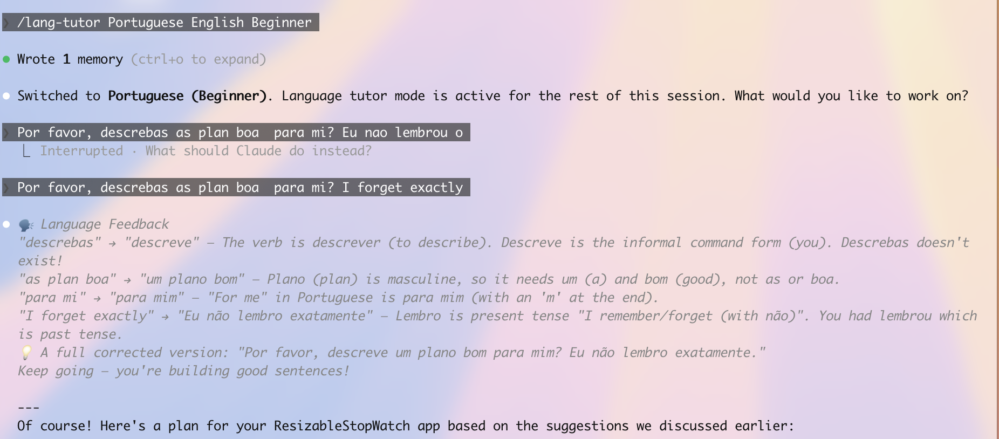
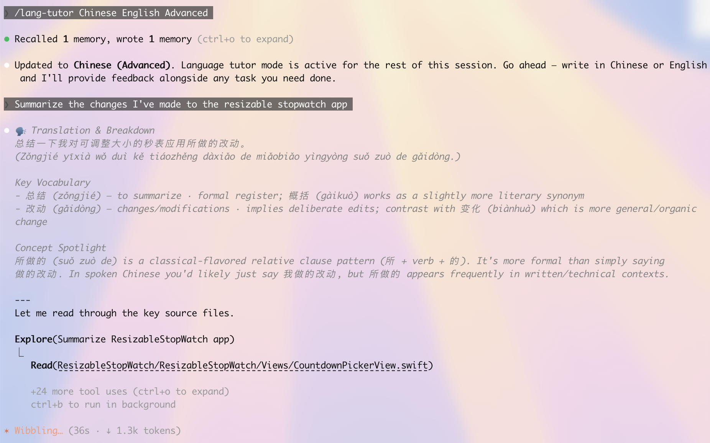
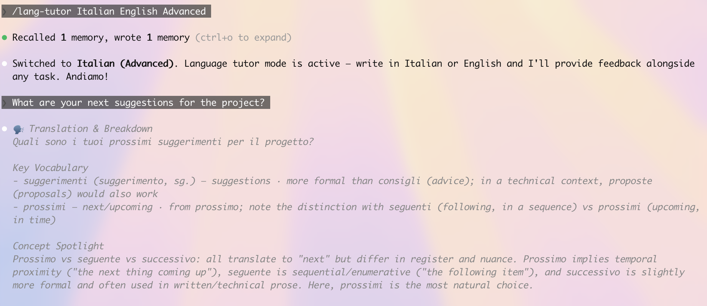

# lang-tutor

**Turn every Claude Code session into a language lesson.**

You're already spending hours in Claude Code — why not learn a language while you work? lang-tutor gives you real-time grammar corrections, idiomatic suggestions, and vocabulary breakdowns on every message, without interrupting your coding flow.

## What it does

Write in your target language and get instant feedback:

```
You: "Eu quero fazer um commit das mudancas"

> 🗣️ Language Feedback
> 💡 A native speaker might say: "Eu quero commitar as alteracoes"
> Natural and idiomatic — keep it up!
```

Write in your native language and get translations with vocabulary breakdowns:

```
You: "Show me the git log"

> 🗣️ Translation & Breakdown
> Translation: Mostra o historico do git.
>
> Key Vocabulary:
> - mostrar — to show · command form: "mostra"
> - historico — history/log · used for any kind of record
```

Then Claude Code handles your actual request as usual. The language feedback is an addition, never a replacement.

## Features

- **Automatic language detection** — no need to toggle modes. Write in either language and get the right feedback
- **Three proficiency levels** — beginner, intermediate, and advanced, each with calibrated feedback depth
- **Preference persistence** — your language, level, and native language are saved across sessions
- **Works with any language** — Portuguese, Spanish, Japanese, Mandarin, French, Korean, Arabic — if Claude speaks it, you can learn it
- **Non-intrusive** — feedback appears in a compact block before the normal response. Your coding workflow stays intact

## Install

```bash
/plugin marketplace add hamsamilton/lang-tutor
/plugin install lang-tutor@hamsamilton-lang-tutor
```

## Usage

```bash
# Start with explicit settings
/lang-tutor Portuguese English Advanced

# Or just the language (defaults to English native, auto-detects level)
/lang-tutor Japanese

# After first use, just activate — it remembers your preferences
/lang-tutor
```

## Proficiency levels

| | Beginner | Intermediate | Advanced |
|---|---|---|---|
| Corrections | All errors with full explanations | Grammar precision focus | Subtle nuance only |
| Translations | Provided liberally | Only uncommon words | Rarely, specialized terms |
| Feedback language | Mix of target + native | Mostly target language | Entirely in target language |
| Focus | Core grammar, vocabulary building | Idioms, common patterns | Register, formality, style |

## Examples

### Translation & Breakdown (Chinese, Beginner)
Write in English and get a full translation with vocabulary and grammar concepts tailored to your level.



### Language Feedback (Portuguese, Beginner)
Write in your target language and get detailed grammar corrections with explanations.



### Coding Workflow Integration (Chinese, Advanced)
Language feedback appears alongside your normal coding tasks — it never gets in the way.



### Advanced Nuance (Italian, Advanced)
At higher levels, feedback focuses on register, word choice, and subtle distinctions.



## License

MIT
