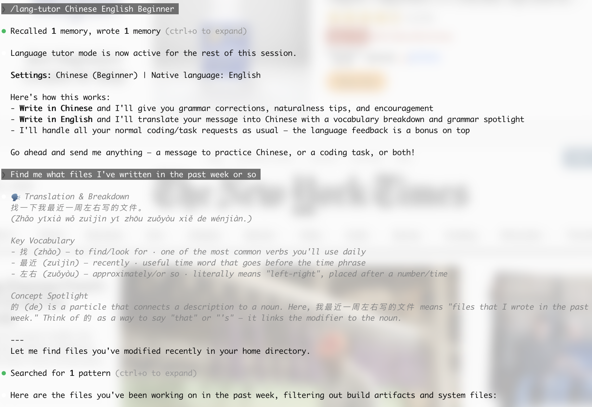
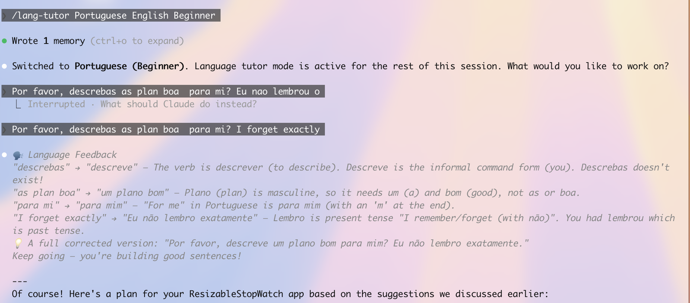
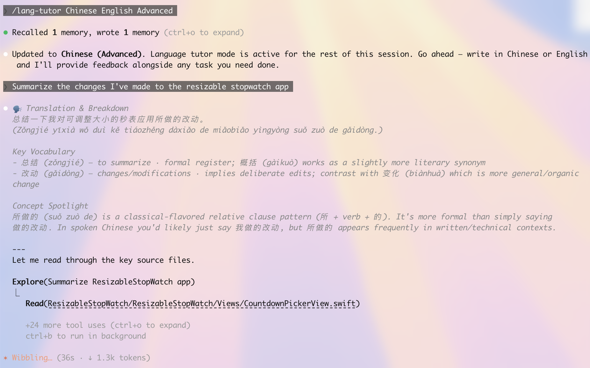
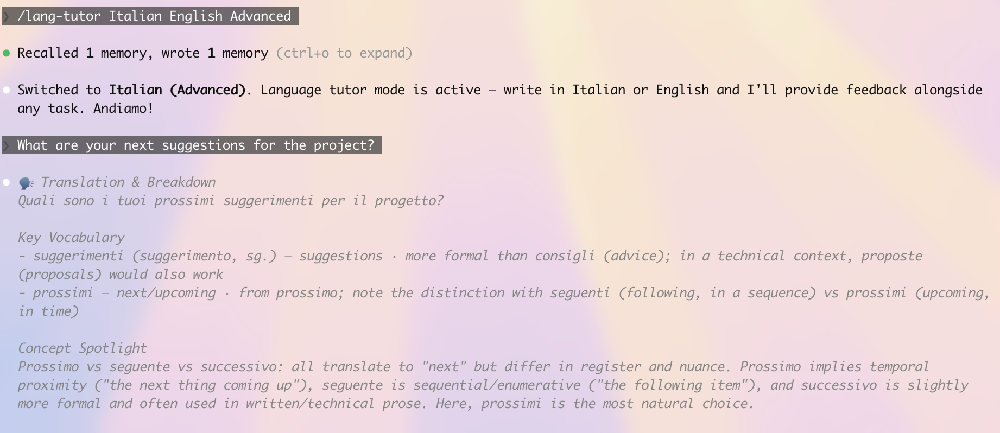

# lang-tutor — Learn English (or Any Language) While You Code (Claude Code Plugin)

**Turn every Claude Code session into a language lesson.**

lang-tutor is a free, open-source Claude Code plugin/skill that helps you learn English while you code — along with Chinese, Japanese, Spanish, French, German, Korean, and more. It's built for the huge number of developers worldwide who already code in Claude Code every day and are also learning English as a second language: instead of a separate app or class, lang-tutor gives you real-time English grammar corrections, idiomatic suggestions, and vocabulary breakdowns on every message, without interrupting your coding flow.

If you've been searching for a way to practice English for programmers and developers, an English learning tool that doesn't require a separate app, or a Claude Code skill/plugin for learning English (or any other language) on the job, this is it.

## What it does

Learning English as a second language? Write in English and get instant, native-speaker-level corrections:

```
You: "I want to make a commit of the changes"

> 🗣️ Language Feedback
> 💡 A native speaker might say: "I want to commit the changes"
> Close! "commit" already implies the changes — no need for "a commit of"
```

Write in your target language (Portuguese in this example) and get instant feedback:

```
You: "Eu quero fazer um commit das mudancas"

> 🗣️ Language Feedback
> 💡 A native speaker might say: "Eu quero commitar as alteracoes"
> Natural and idiomatic — keep it up!
```

Write in your native language and get translations with vocabulary breakdowns:

```
You: "Show me the git log"

> 🗣️ Translation & Breakdown
> Translation: Mostra o historico do git.
>
> Key Vocabulary:
> - mostrar — to show · command form: "mostra"
> - historico — history/log · used for any kind of record
```

Then Claude Code handles your actual request as usual. The language feedback is an addition, never a replacement.

## Features

- **Automatic language detection** — no need to toggle modes. Write in either language and get the right feedback
- **Three proficiency levels** — beginner, intermediate, and advanced, each with calibrated feedback depth
- **Aligned to real proficiency frameworks** — levels map to the standard your language actually uses (HSK, JLPT, TOPIK, CEFR/DELE/DELF/Goethe, ТРКИ, ulpan levels, BIPA…), each with an ordered grammar syllabus drawn from how the language is really taught
- **Irregulars never slip past** — every guide sorts its irregular forms into three tiers (class irregular, locally irregular, fully irregular), because a learner who meets an irregular unflagged will generalize the wrong pattern
- **Preference persistence** — your language, level, and native language are saved across sessions
- **Works with any language** — dedicated guides for the most popular languages, plus a generic guide for everything else. If Claude speaks it, you can learn it
- **Non-intrusive** — feedback appears in a compact block before the normal response. Your coding workflow stays intact

## Why learn English (or any language) with Claude Code?

Most language learning apps ask you to carve out separate time — a Duolingo streak, a flashcard deck, an app you have to remember to open. That's especially hard when you're a developer already writing English-language commit messages, code comments, and prompts all day. lang-tutor works differently: it rides along on time you're already spending in Claude Code. Every commit message, every question you ask, every plan you write becomes an opportunity to practice English or any other language you're learning — with zero extra time cost.

This makes lang-tutor especially useful for non-native English speakers in tech, since English is already the working language of code, documentation, and most Claude Code sessions. You get corrected and coached in the exact English you actually use at work.

## Supported languages

English is fully supported as a dedicated target language — set it as your target and lang-tutor gives you real-time English corrections, idiom and phrasal-verb suggestions, and article/preposition coaching tuned for ESL learners of any native-language background. It's one of 25 languages with a dedicated tutor guide, each with language-specific error categories, deep-dives, and pitfall coverage:

Each guide is aligned to the proficiency framework its learners actually encounter, so "beginner" and "advanced" map to concrete, published milestones rather than vague labels:

| Language | Framework | Guide highlights |
|---|---|---|
| English | CEFR A1–C2 | Articles, prepositions, present perfect vs. simple past, phrasal verbs, ESL error patterns |
| Chinese (Mandarin) | HSK 1–6 | Character/radical breakdowns, compound words, pinyin, measure words, 了 usage, tone sandhi, 多音字 |
| Japanese | JLPT N5–N1 | Kanji breakdowns, politeness registers, particles, counters, godan/ichidan classing, keigo suppletion |
| Korean | TOPIK 1–6 | Sino-Korean root families, speech levels, particles, two number systems, ㅂ/ㄷ/ㅅ/르 irregular classes |
| Spanish | CEFR / DELE | ser/estar, preterite vs. imperfect, subjunctive triggers, false friends, stem-changing verbs |
| French | CEFR / DELF–DALF | Gender agreement, passé composé vs. imparfait, tu/vous register, ablaut classes, homophone endings |
| Italian | CEFR / CILS–CELI | essere/avere auxiliaries, preposition contractions, congiuntivo, the -isc- class, ci and ne |
| Portuguese | CAPLE / CELPE-Bras | Brazilian/European variants, contractions, ser/estar/ficar, future subjunctive, personal infinitive |
| German | CEFR / Goethe | Case system, word order, separable verbs, compound-noun breakdowns, ablaut classes, plural forms |
| Dutch | CEFR / NT2 | de/het, verb-second vs. verb-final order, separable verbs, false friends, the 't kofschip rule |
| Russian | ТРКИ / TORFL | Case system, verbal aspect pairs, root families, mobile stress, genitive plural |
| Arabic | ACTFL / CEFR\* | Root-and-pattern tables, iḍāfa, non-human plural rule, MSA vs. dialects, weak roots, broken plurals |
| Hindi | CEFR / ACTFL\* | Ergative ने, gender agreement, postpositions, Sanskrit/Persian register layers, irregular perfectives |
| Turkish | CEFR / TÖMER | Vowel harmony, suffix-stack decomposition, var/yok, evidential -miş, consonant softening |
| Vietnamese | Bậc 1–6 (MOET) | Tones, classifiers, kinship pronouns, compound words, Sino-Vietnamese doublets |
| Polish | CEFR | 7-case system, aspect pairs, virile/non-virile plurals, palatalization, numeral agreement |
| Thai | CU-TFL / CEFR | Tone breakdowns and tone *rules*, classifiers, topic-comment structure, register tiers |
| Indonesian | BIPA 1–7 | Affix families (me-/di-/ber-/-kan), nasal assimilation, reduplication, voice choice |
| Hebrew | Ulpan א–ו | Binyanim verb patterns, root-and-pattern tables, construct state, weak-root families |
| Greek | CEFR / Ελληνομάθεια | 4-case declension, three genders, verb aspect stems, aorist formation, Greek-to-English cognates |
| Ukrainian | CEFR / УМІ | 7-case system including the active vocative, aspect pairs, the о/е → і alternation |
| Swedish | CEFR / SFI, Tisus | en/ett gender, definite suffixes, strict V2 word order, the four verb classes, plural declensions |
| Persian (Farsi) | AZFA / CEFR | Ezafe chains, compound/light verbs, SOV order, را object marker, unguessable present stems |
| Filipino (Tagalog) | CEFR / ACTFL\* | Actor/object-focus trigger system, ang/ng/sa particles, aspect via infix and reduplication, Taglish |
| Bengali | CEFR / ACTFL\* | Three-tier honorific register (তুই/তুমি/আপনি), classifiers, no grammatical gender, stem-vowel classes |

\* Arabic, Hindi, Filipino, and Bengali have no single dominant proficiency framework for foreign learners. Their guides say so explicitly and list the competing standards rather than implying a single ladder exists.

Any other language (Swahili, Finnish, Zulu, ...) works through the generic guide, which provides the same feedback modes without language-specific tailoring.

## How it works

The skill is split for token efficiency. A slim `SKILL.md` handles your language status (target language, native language, level) and routing, then loads two files on demand from `skills/lang-tutor/languages/`:

- **`_common.md`** — the shared spine: the two feedback modes and their block formats, the universal deep-dive types, the baseline level tables, and the Irregularity Watch that runs on every response
- **`<your-language>.md`** — the language guide: script conventions, proficiency-framework alignment, an ordered grammar syllabus, the irregulars worth prioritizing, language-specific deep-dives, and pitfalls

`_common.md` defines the structure; the language guide supplies the substance and wins wherever both speak to the same thing. Splitting them this way keeps each language file focused on what is actually specific to that language rather than repeating the same boilerplate 25 times.

Your status is stored in Claude's auto-memory, so it persists across sessions and plugin updates. An optional `UserPromptSubmit` hook re-injects a one-line reminder on each message so tutor mode can't drift out of attention in long sessions; it costs ~60 tokens per message while active and emits nothing in sessions where lang-tutor was never activated.

## Install

### Via Plugin Marketplace

```bash
/plugin marketplace add hamsamilton/lang-tutor
/plugin install lang-tutor@hamsamilton-lang-tutor
```

### Direct Install from GitHub

Clone the repo anywhere, then symlink the skill directory (it must be the `skills/lang-tutor` subdirectory, so the `languages/` guides come along):

```bash
git clone https://github.com/hamsamilton/lang-tutor ~/lang-tutor
ln -s ~/lang-tutor/skills/lang-tutor ~/.claude/skills/lang-tutor
```

Then activate in any Claude Code session:

```bash
/lang-tutor
```

## Usage

```bash
# Learning English, native language Spanish
/lang-tutor English Spanish Beginner

# Start with explicit settings for another language
/lang-tutor Portuguese English Advanced

# Or just the language (defaults to English native, auto-detects level)
/lang-tutor Japanese

# After first use, just activate — it remembers your preferences
/lang-tutor
```

## Proficiency levels

| | Beginner | Intermediate | Advanced |
|---|---|---|---|
| Corrections | All errors with full explanations | Grammar precision focus | Subtle nuance only |
| Translations | Provided liberally | Only uncommon words | Rarely, specialized terms |
| Feedback language | Mix of target + native | Mostly target language | Entirely in target language |
| Focus | Core grammar, vocabulary building | Idioms, common patterns | Register, formality, style |
| Framework band | e.g. HSK 1–2, JLPT N5–N4, CEFR A1–A2 | HSK 3–4, JLPT N3–N2, CEFR B1–B2 | HSK 5–6, JLPT N1, CEFR C1–C2 |

Each guide adds a grammar-focus row on top of these, listing the specific structures that belong at each band — so at HSK 1–2 you're working on 是/有/在 and measure words, while HSK 3–4 moves you to 了 vs. 过 and the 把 construction.

## Examples

### Translation & Breakdown (Chinese, Beginner)
Write in English and get a full translation with vocabulary and grammar concepts tailored to your level.



### Language Feedback (Portuguese, Beginner)
Write in your target language and get detailed grammar corrections with explanations.



### Coding Workflow Integration (Chinese, Advanced)
Language feedback appears alongside your normal coding tasks — it never gets in the way.



### Advanced Nuance (Italian, Advanced)
At higher levels, feedback focuses on register, word choice, and subtle distinctions.



## FAQ

**Can I really learn a language just by using Claude Code?**
lang-tutor won't replace focused study, but it adds consistent, low-effort exposure — corrections and vocabulary in context, every session, with no extra app to open. It's best paired with other study, not a full substitute for it.

**Does this slow down or interrupt my coding workflow?**
No. Language feedback appears as a compact block before Claude's normal response. Claude Code still handles your actual request as usual.

**Can I use lang-tutor to learn English as a second language?**
Yes — set English as your target language (`/lang-tutor English <your native language>`) and lang-tutor corrects your English in real time as you write commit messages, ask questions, and describe tasks in Claude Code, at whatever proficiency level you set.

**What languages does lang-tutor support?**
25 languages with dedicated tutor guides: English, Chinese, Japanese, Korean, Spanish, French, Italian, Portuguese, German, Dutch, Russian, Arabic, Hindi, Turkish, Vietnamese, Polish, Thai, Indonesian, Hebrew, Greek, Ukrainian, Swedish, Persian (Farsi), Filipino (Tagalog), and Bengali — plus a generic guide that works for any other language Claude speaks.

**Is lang-tutor free?**
Yes, it's free and open source under the MIT license. Install it as a Claude Code plugin or clone it directly from GitHub.

**Do I need to know the language already?**
No. lang-tutor supports beginner, intermediate, and advanced proficiency levels, with feedback depth calibrated to each.

## License

MIT
